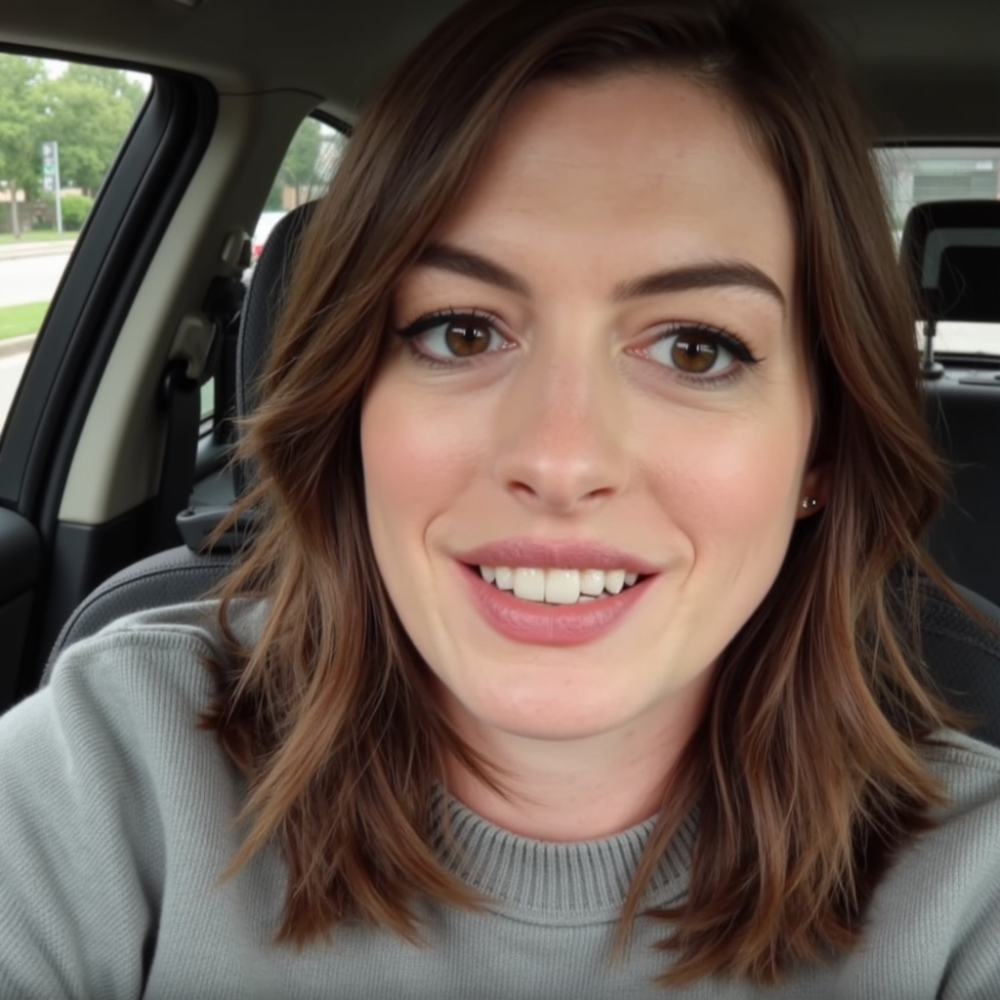
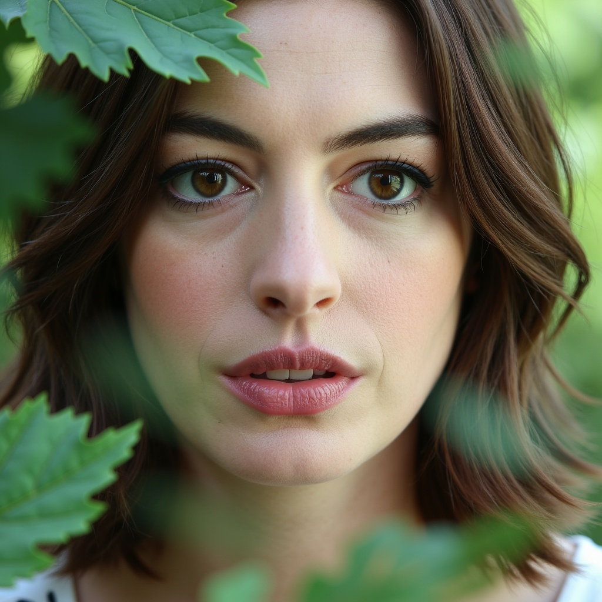
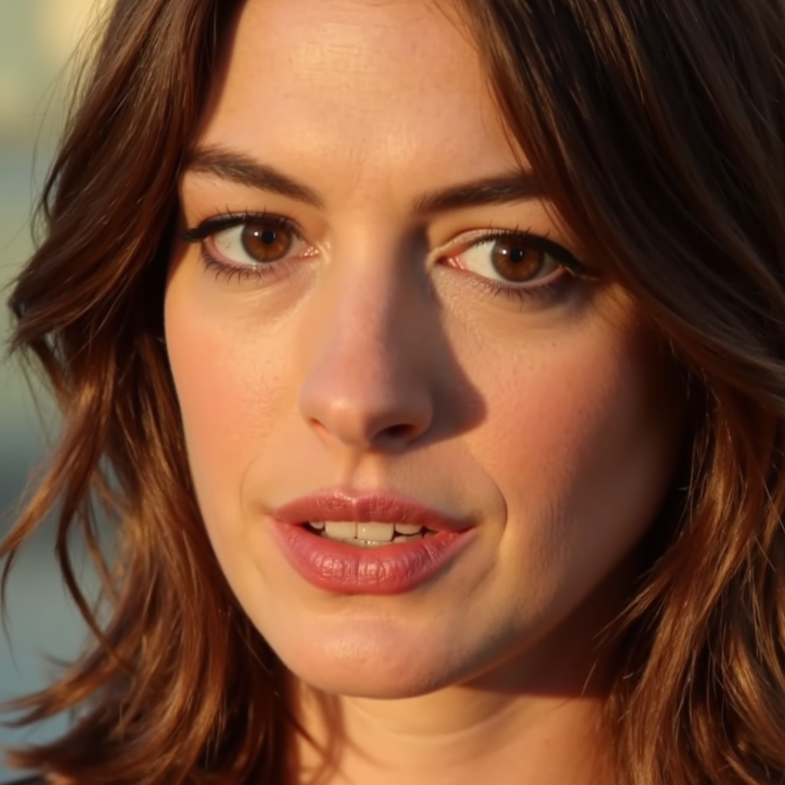
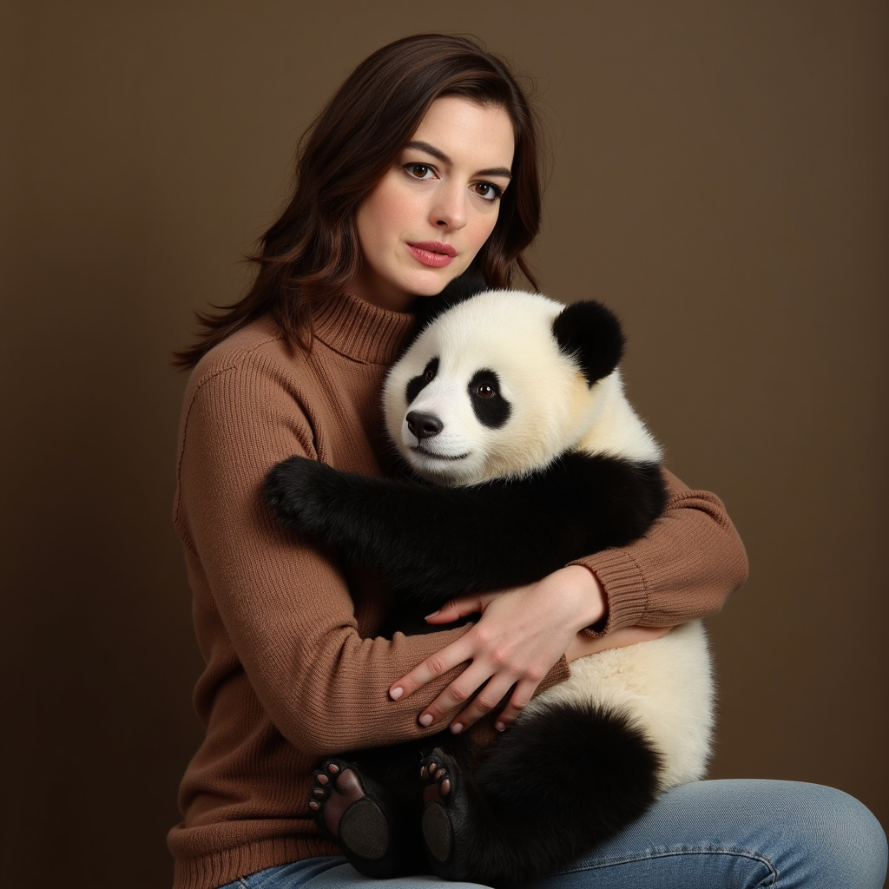

# LoRA Training for Qwen-Image, Qwen-Image-Edit & FLUX.1-dev

An open-source implementation for training LoRA (Low-Rank Adaptation) layers for Qwen/Qwen-Image, Qwen/Qwen-Image-Edit, and FLUX.1-dev models by [FlyMy.AI](https://flymy.ai).

<p align="center">
  
</p>

## Star History

[](https://www.star-history.com/#FlyMyAI/flymyai-lora-trainer&Date)

## 🌟 About FlyMy.AI

Agentic Infra for GenAI. FlyMy.AI is a B2B infrastructure for building and running GenAI Media agents.


**🔗 Useful Links:**
- 🌐 [Official Website](https://flymy.ai)
- 📚 [Documentation](https://docs.flymy.ai/intro)
- 💬 [Discord Community](https://discord.com/invite/t6hPBpSebw)
- 🤗 [Pre-trained Qwen LoRA Model](https://huggingface.co/flymy-ai/qwen-image-realism-lora)
- 🤗 [Pre-trained FLUX LoRA Model](https://huggingface.co/flymy-ai/flux-dev-anne-hathaway-lora)
- 🚀 [Train Your Own FLUX LoRA](https://app.flymy.ai/models/flymyai/flux-lora-trainer-fast)
- 🐦 [X (Twitter)](https://x.com/flymyai)
- 💼 [LinkedIn](https://linkedin.com/company/flymyai)
- 📺 [YouTube](https://youtube.com/@flymyai)
- 📸 [Instagram](https://www.instagram.com/flymy_ai)

## 🚀 Features

- LoRA-based fine-tuning for efficient training
- Support for Qwen-Image, Qwen-Image-Edit, and FLUX.1-dev models
- Compatible with Hugging Face `diffusers`
- Easy configuration via YAML
- Control-based image editing with LoRA
- Open-source implementation for LoRA training
- Full training support for Qwen-Image
- High-quality portrait and character training for FLUX

## 📅 Updates

**16.10.2025**
- ✅ Added FLUX.1-dev LoRA training support
- ✅ Added pre-trained FLUX LoRA model example

**02.09.2025**
- ✅ Added full training for Qwen-Image and Qwen-Image-Edit

**20.08.2025**
- ✅ Added Qwen-Image-Edit LoRA trainer support

**09.08.2025**
- ✅ Add pipeline for train for < 24GiB GPU

**08.08.2025**
- ✅ Added comprehensive dataset preparation instructions
- ✅ Added dataset validation script (`utils/validate_dataset.py`)
- ✅ Freeze model weights during training

## ⚠️ Project Status

**🚧 Under Development:** We are actively working on improving the code and adding test coverage. The project is in the refinement stage but ready for use.

**📋 Development Plans:**
- ✅ Basic code is working
- ✅ Training functionality implemented
- ✅ FLUX.1-dev support added
- 🔄 Performance optimization in progress
- 🔜 Test coverage coming soon

---

## 📦 Installation

**Requirements:**
- Python 3.10

1. Clone the repository and navigate into it:
   ```bash
   git clone https://github.com/FlyMyAI/flymyai-lora-trainer
   cd flymyai-lora-trainer
   ```

2. Install required packages:
   ```bash
   pip install -r requirements.txt
   ```

3. Install the latest `diffusers` from GitHub:
   ```bash
   pip install git+https://github.com/huggingface/diffusers
   ```

4. Download pre-trained LoRA weights (optional):
   ```bash
   # Qwen LoRA weights
   git clone https://huggingface.co/flymy-ai/qwen-image-realism-lora
   
   # FLUX LoRA weights
   git clone https://huggingface.co/flymy-ai/flux-dev-anne-hathaway-lora
   
   # Or download specific files
   wget https://huggingface.co/flymy-ai/qwen-image-realism-lora/resolve/main/flymy_realism.safetensors
   wget https://huggingface.co/flymy-ai/flux-dev-anne-hathaway-lora/resolve/main/pytorch_lora_weights.safetensors
   ```

---

## 📁 Data Preparation

### Dataset Structure for Training

The training data should follow the same format for both Qwen and FLUX models, where each image has a corresponding text file with the same name:

```
dataset/
├── img1.png
├── img1.txt
├── img2.jpg
├── img2.txt
├── img3.png
├── img3.txt
└── ...
```

### Dataset Structure for Qwen-Image-Edit Training

For control-based image editing, the dataset should be organized with separate directories for target images/captions and control images:

```
dataset/
├── images/           # Target images and their captions
│   ├── image_001.jpg
│   ├── image_001.txt
│   ├── image_002.jpg
│   ├── image_002.txt
│   └── ...
└── control/          # Control images
    ├── image_001.jpg
    ├── image_002.jpg
    └── ...
```
### Data Format Requirements

1. **Images**: Support common formats (PNG, JPG, JPEG, WEBP)
2. **Text files**: Plain text files containing image descriptions
3. **File naming**: Each image must have a corresponding text file with the same base name

### Example Data Structure

```
my_training_data/
├── portrait_001.png
├── portrait_001.txt
├── landscape_042.jpg
├── landscape_042.txt
├── abstract_design.png
├── abstract_design.txt
└── style_reference.jpg
└── style_reference.txt
```

### Text File Content Examples

**For FLUX character training (portrait_001.txt):**
```
ohwx woman, professional headshot, studio lighting, elegant pose, looking at camera
```

**For Qwen landscape training (landscape_042.txt):**
```
Mountain landscape at sunset, dramatic clouds, golden hour lighting, wide angle view
```

**For FLUX portrait training (abstract_design.txt):**
```
ohwx woman, modern portrait style, soft lighting, artistic composition
```

### Data Preparation Tips

1. **Image Quality**: Use high-resolution images (recommended 1024x1024 or higher)
2. **Description Quality**: Write detailed, accurate descriptions of your images
3. **Consistency**: Maintain consistent style and quality across your dataset
4. **Dataset Size**: For good results, use at least 10-50 image-text pairs
5. **Trigger Words**: 
   - For FLUX character training: Use "ohwx woman" or "ohwx man" as trigger words
   - For Qwen training: No specific trigger words required
6. **Auto-generate descriptions**: You can generate image descriptions automatically using [Florence-2](https://huggingface.co/spaces/gokaygokay/Florence-2)

### Quick Data Validation

You can verify your data structure using the included validation utility:

```bash
python utils/validate_dataset.py --path path/to/your/dataset
```

This will check that:
- Each image has a corresponding text file
- All files follow the correct naming convention
- Report any missing files or inconsistencies

---

## 🏁 Start Training on < 24gb vram

To begin training with your configuration file (e.g., `train_lora_4090.yaml`), run:

```bash
accelerate launch train_4090.py --config ./train_configs/train_lora_4090.yaml
```


## 🏁 Training

# Qwen Models Training

## Qwen-Image LoRA Training

To begin training with your configuration file (e.g., `train_lora.yaml`), run:

```bash
accelerate launch train.py --config ./train_configs/train_lora.yaml
```

Make sure `train_lora.yaml` is correctly set up with paths to your dataset, model, output directory, and other parameters.


### Qwen-Image Full Training

To begin training with your configuration file (e.g., `train_full_qwen_image.yaml`), run:

```bash
accelerate launch train_full_qwen_image.py --config ./train_configs/train_full_qwen_image.yaml
```

Make sure `train_full_qwen_image.yaml` is correctly set up with paths to your dataset, model, output directory, and other parameters.
The proposed method was tested on an NVIDIA H200 GPU environment.
#### Loading Trained Full Model

After training, you can load your trained model from the checkpoint directory for inference.

**Simple Example:**

```python
from diffusers import QwenImagePipeline, QwenImageTransformer2DModel, AutoencoderKLQwenImage
import torch
from omegaconf import OmegaConf
import os

def load_trained_model(checkpoint_path):
    """Load trained model from checkpoint"""
    print(f"Loading trained model from: {checkpoint_path}")
    
    # Load config to get original model path
    config_path = os.path.join(checkpoint_path, "config.yaml")
    config = OmegaConf.load(config_path)
    original_model_path = config.pretrained_model_name_or_path
    
    # Load trained transformer
    transformer_path = os.path.join(checkpoint_path, "transformer")
    transformer = QwenImageTransformer2DModel.from_pretrained(
        transformer_path,
        torch_dtype=torch.bfloat16,
        low_cpu_mem_usage=True
    )
    transformer.to("cuda")
    transformer.eval()
    
    # Load VAE from original model
    vae = AutoencoderKLQwenImage.from_pretrained(
        original_model_path,
        subfolder="vae",
        torch_dtype=torch.bfloat16
    )
    vae.to("cuda")
    vae.eval()
    
    # Create pipeline
    pipe = QwenImagePipeline.from_pretrained(
        original_model_path,
        transformer=transformer,
        vae=vae,
        torch_dtype=torch.bfloat16
    )
    pipe.to("cuda")
    
    print("Model loaded successfully!")
    return pipe

# Usage
checkpoint_path = "/path/to/your/checkpoint"
pipe = load_trained_model(checkpoint_path)

# Generate image
prompt = "A beautiful landscape with mountains and lake"
image = pipe(
    prompt=prompt,
    width=768,
    height=768,
    num_inference_steps=30,
    true_cfg_scale=5,
    generator=torch.Generator(device="cuda").manual_seed(42)
)

# Save result
output_image = image.images[0]
output_image.save("generated_image.png")
```

**Complete Example Script:**

```bash
python inference_trained_model_gpu_optimized.py
```

**Checkpoint Structure:**

The trained model is saved in the following structure:
```
checkpoint/
├── config.yaml          # Training configuration
└── transformer/         # Trained transformer weights
    ├── config.json
    ├── diffusion_pytorch_model.safetensors.index.json
    └── diffusion_pytorch_model-00001-of-00005.safetensors
    └── ... (multiple shard files)
```


### Qwen-Image-Edit LoRA Training

For control-based image editing training, use the specialized training script:

```bash
accelerate launch train_qwen_edit_lora.py --config ./train_configs/train_lora_qwen_edit.yaml
```

#### Configuration for Qwen-Image-Edit

The configuration file `train_lora_qwen_edit.yaml` should include:

- `img_dir`: Path to target images and captions directory (e.g., `./extracted_dataset/train/images`)
- `control_dir`: Path to control images directory (e.g., `./extracted_dataset/train/control`)
- Other standard LoRA training parameters

## 🧪 Usage

### Qwen-Image-Edit Full Training

To begin training with your configuration file (e.g., `train_full_qwen_edit.yaml`), run:

```bash
accelerate launch train_full_qwen_edit.py --config ./train_configs/train_full_qwen_edit.yaml
```

---

### 🔧 Qwen-Image Initialization

```python
from diffusers import DiffusionPipeline
import torch

model_name = "Qwen/Qwen-Image"

# Load the pipeline
if torch.cuda.is_available():
    torch_dtype = torch.bfloat16
    device = "cuda"
else:
    torch_dtype = torch.float32
    device = "cpu"

pipe = DiffusionPipeline.from_pretrained(model_name, torch_dtype=torch_dtype)
pipe = pipe.to(device)
```

### 🔧 Qwen-Image-Edit Initialization

```python
from diffusers import QwenImageEditPipeline
import torch
from PIL import Image

# Load the pipeline
pipeline = QwenImageEditPipeline.from_pretrained("Qwen/Qwen-Image-Edit")
pipeline.to(torch.bfloat16)
pipeline.to("cuda")
```

### 🔌 Load LoRA Weights

For Qwen-Image:
```python
# Load LoRA weights
pipe.load_lora_weights('flymy-ai/qwen-image-realism-lora', adapter_name="lora")
```

For Qwen-Image-Edit:
```python
# Load trained LoRA weights
pipeline.load_lora_weights("/path/to/your/trained/lora/pytorch_lora_weights.safetensors")
```

### 🎨 Generate Image with Qwen-Image LoRA
You can find LoRA weights [here](https://huggingface.co/flymy-ai/qwen-image-realism-lora)

No trigger word required
```python
prompt = '''Super Realism portrait of a teenager woman of African descent, serene calmness, arms crossed, illuminated by dramatic studio lighting, sunlit park in the background, adorned with delicate jewelry, three-quarter view, sun-kissed skin with natural imperfections, loose shoulder-length curls, slightly squinting eyes, environmental street portrait with text "FLYMY AI" on t-shirt.'''
negative_prompt =  " "
image = pipe(
    prompt=prompt,
    negative_prompt=negative_prompt,
    width=1024,
    height=1024,
    num_inference_steps=50,
    true_cfg_scale=5,
    generator=torch.Generator(device="cuda").manual_seed(346346)
)

# Display the image (in Jupyter or save to file)
image.show()
# or
image.save("output.png")
```

### 🎨 Edit Image with Qwen-Image-Edit LoRA

```python
# Load input image
image = Image.open("/path/to/your/input/image.jpg").convert("RGB")

# Define editing prompt
prompt = "Make a shot in the same scene of the person moving further away from the camera, keeping the camera steady to maintain focus on the central subject, gradually zooming out to capture more of the surrounding environment as the figure becomes less detailed in the distance."

# Generate edited image
inputs = {
    "image": image,
    "prompt": prompt,
    "generator": torch.manual_seed(0),
    "true_cfg_scale": 4.0,
    "negative_prompt": " ",
    "num_inference_steps": 50,
}

with torch.inference_mode():
    output = pipeline(**inputs)
    output_image = output.images[0]
    output_image.save("edited_image.png")
```

### 🖼️ Sample Output - Qwen-Image


### 🖼️ Sample Output - Qwen-Image-Edit

**Input Image:**


**Prompt:** 
"Make a shot in the same scene of the left hand securing the edge of the cutting board while the right hand tilts it, causing the chopped tomatoes to slide off into the pan, camera angle shifts slightly to the left to center more on the pan."

**Output without LoRA:**


**Output with LoRA:**


---

# FLUX.1-dev Models Training

## FLUX.1-dev LoRA Training

FLUX.1-dev is a powerful text-to-image model that excels at generating high-quality portraits and character images. Our LoRA training implementation allows you to fine-tune FLUX for specific characters or styles.

### Start FLUX Training

To begin FLUX LoRA training with your configuration file, run:

```bash
accelerate launch train_flux_lora.py --config ./train_configs/train_flux_config.yaml
```

Make sure `train_flux_config.yaml` is correctly set up with paths to your dataset, model, output directory, and other parameters.

### 🔧 FLUX.1-dev Initialization

```python
from diffusers import DiffusionPipeline
import torch

model_name = "black-forest-labs/FLUX.1-dev"

# Load the pipeline
if torch.cuda.is_available():
    torch_dtype = torch.bfloat16
    device = "cuda"
else:
    torch_dtype = torch.float32
    device = "cpu"

pipe = DiffusionPipeline.from_pretrained(model_name, torch_dtype=torch_dtype)
pipe = pipe.to(device)
```

### 🔌 Load FLUX LoRA Weights

```python
# Load LoRA weights
pipe.load_lora_weights('flymy-ai/flux-dev-anne-hathaway-lora', adapter_name="lora")
```

### 🎨 Generate Image with FLUX LoRA

You can find our pre-trained FLUX LoRA weights [here](https://huggingface.co/flymy-ai/flux-dev-anne-hathaway-lora)

**Trigger word required: "ohwx woman"**

```python
prompt = '''Portrait of ohwx woman, professional headshot, studio lighting, elegant pose, looking at camera, soft shadows, high quality, detailed facial features, cinematic lighting, 85mm lens, shallow depth of field'''
negative_prompt = "blurry, low quality, distorted, bad anatomy"
image = pipe(
    prompt=prompt,
    negative_prompt=negative_prompt,
    width=1024,
    height=1024,
    num_inference_steps=30,
    guidance_scale=3.5,
    generator=torch.Generator(device="cuda").manual_seed(346346)
)

# Display the image (in Jupyter or save to file)
image.images[0].show()
# or
image.images[0].save("output.png")
```

### 🖼️ Sample FLUX Output


## 🎨 FLUX Generation Examples

Below are examples of images generated with our FLUX Anne Hathaway LoRA model:

### Casual Portrait Selfie

**Prompt**: _"ohwx woman portrait selfie"_



### Artistic Double Exposure

**Prompt**: _"ohwx woman perfectly symmetrical young female face close-up, presented with double exposure overlay blending nature textures like leaves and water"_



### Golden Hour Macro Portrait

**Prompt**: _"ohwx woman Macro photography style close-up of female face with light makeup, focused on eyes and lips, illuminated by golden hour sunlight for warm tones"_



### Cozy Portrait with Panda

**Prompt**: _"Close-up of ohwx woman in brown knitted turtleneck sweater. Sitting with big black and white panda, hugging it, looking at camera"_



### 🚀 Train Your Own FLUX LoRA

Want to train your own FLUX LoRA model? Use our online training platform:

**[🚀 Train Your Own FLUX LoRA on FlyMy.AI](https://app.flymy.ai/models/flymyai/flux-lora-trainer-fast)**

Features:
- ✅ Easy-to-use web interface
- ✅ No local GPU required
- ✅ Optimized training pipeline
- ✅ Fast training times
- ✅ Professional results

---

## 🎛️ Using with ComfyUI

We provide ready-to-use ComfyUI workflows that work with both our Qwen and FLUX trained LoRA models. Follow these steps to set up and use the workflows:

### Setup Instructions

1. **Download the latest ComfyUI**:
   - Visit the [ComfyUI GitHub repository](https://github.com/comfyanonymous/ComfyUI)
   - Clone or download the latest version

2. **Install ComfyUI**:
   - Follow the installation instructions from the [ComfyUI repository](https://github.com/comfyanonymous/ComfyUI?tab=readme-ov-file#installing)
   - Make sure all dependencies are properly installed

3. **Download model weights**:
   
   **For Qwen-Image:**
   - Go to [Qwen-Image ComfyUI weights](https://huggingface.co/Comfy-Org/Qwen-Image_ComfyUI/tree/main)
   - Download all the model files
   
   **For FLUX.1-dev:**
   - Go to [FLUX.1-dev model](https://huggingface.co/black-forest-labs/FLUX.1-dev)
   - Download all the model files

4. **Place model weights in ComfyUI**:
   - Copy the downloaded model files to the appropriate folders in `ComfyUI/models/`
   - Follow the folder structure as specified in the model repositories

5. **Download our pre-trained LoRA weights**:
   - **Qwen LoRA:** [flymy-ai/qwen-image-realism-lora](https://huggingface.co/flymy-ai/qwen-image-realism-lora)
   - **FLUX LoRA:** [flymy-ai/flux-dev-anne-hathaway-lora](https://huggingface.co/flymy-ai/flux-dev-anne-hathaway-lora)
   - Download the LoRA `.safetensors` files

6. **Place LoRA weights in ComfyUI**:
   - Copy the LoRA files to `ComfyUI/models/loras/`

7. **Load the workflow**:
   - Open ComfyUI in your browser
   - **For Qwen:** Load `qwen_image_lora_example.json`
   - **For FLUX:** Load `flux_anne_hathaway_lora_example.json`
   - The workflows are pre-configured to work with our LoRA models

### Workflow Features

- ✅ Pre-configured for Qwen-Image + LoRA inference
- ✅ Pre-configured for FLUX.1-dev + LoRA inference
- ✅ Optimized settings for best quality output
- ✅ Easy prompt and parameter adjustment
- ✅ Compatible with all our trained LoRA models

The ComfyUI workflows provide a user-friendly interface for generating images with our trained LoRA models without needing to write Python code.

### 🖼️ Workflow Screenshot


---

## 🤝 Support

If you have questions or suggestions, join our community:
- 🌐 [FlyMy.AI](https://flymy.ai)
- 💬 [Discord Community](https://discord.com/invite/t6hPBpSebw)
- 🐦 [Follow us on X](https://x.com/flymyai)
- 💼 [Connect on LinkedIn](https://linkedin.com/company/flymyai)
- 📧 [Support](mailto:support@flymy.ai)

**⭐ Don't forget to star the repository if you like it!**
